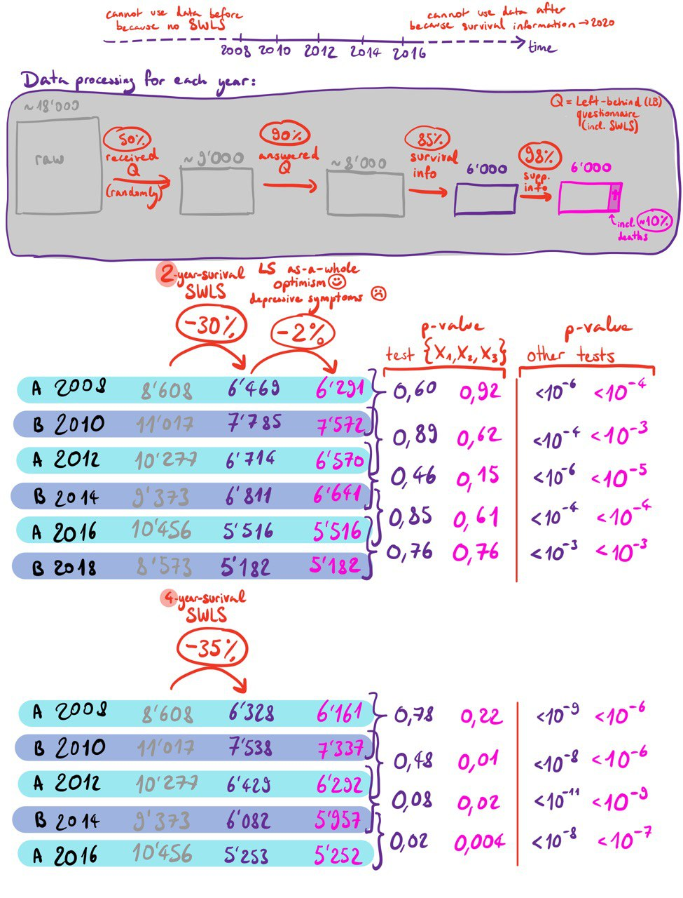
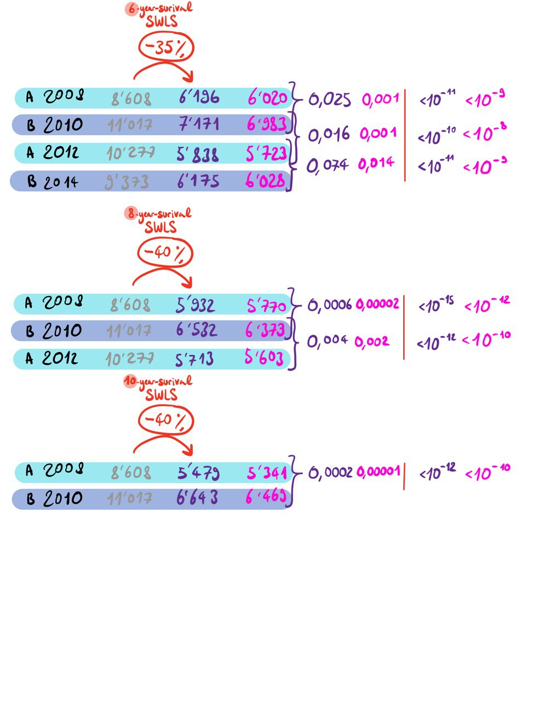

# Master's thesis code
## Psychometric tests as tools for causal inference
_This code was written in the context of my Master's thesis at EPFL, in Winter 2024-2025. It extends the code from [VanderWeele and Vanderstaadt (2022)](https://github.com/svsteela/StructuralRejection/tree/main), which tests the structural interpretation of the reflective and univariate latent factor model. In this README file, we present how to load the data from the HRS, the structure of the repository, how to preprocess the data and run the analyses, including the test of the structural interpretation and the assessment of psychometric reliability and validity._

Access the data:
- In this study, we exclusively used `.dta` files, so make sure to download this type of files.
- All the data are openly accessible on the Health and Retirement Study website: [HRS](https://hrsdata.isr.umich.edu/).
- There, download the years (also called waves) of interest into the dta file:
    - [Core files](https://hrsdata.isr.umich.edu/data-products/public-survey-data) (contains all answers to all questionnaires in 2-year intervals)
    - [Exit files](https://hrsdata.isr.umich.edu/data-products/rand-hrs-exitpost-exit-interview-and-finder-files-2020) (registers the people who die)
- Strictly follow the example of structure for the files downloaded bellow.

Structure of the repository:

    .
    ├── main.R                  # loads data sets from csvs and generates a table in csvs
    ├── (names_covariates.R)    # list of the names of the covariates. This list is not used
    ├── preprocessing.R         # preprocesses the files from dtas and generates new files in csvs
    ├── stde.R                  # contains functions for testing the structural assumption of the LFM
    ├── validity_assessment.R   # similar to main.R but only computes the correlations with some chosen criteria
    ├── csvs                        # folder to store processed data and results
    │   ├── data_2006.csv           # 2006 processed data
    │   ├── data_2008.csv           # 2008 processed data
    │   ├── ...               
    │   ├── results_2010_2012.csv   # results for 2010 and 2012
    │   ├── validity_2010_2012.csv  # validity results for 2010 and 2012
    │   └── ...
    └── dta                                 # folder to store raw HRS data 
        ├── h06f4a_STATA                    # 2006 core file
        │   └── h06f4a.dta                  # 2006 core data
        ├── h08f3a_STATA                    # 2008 core file
        │   └── h08f3a.dta                  # 2008 core data
        ├── ...
        └── randhrsexit1994_2020v1_STATA    # all exit files until 2020
            ├── randhrsexit2008v1_STATA     # 2008 exit folder
            │   └── randhrsexit2008v1.dta"  # 2008 exit file
            └── randhrsexit2010v1_STATA     # 2010 exit folder
            │   └── randhrsexit2010v1.dta"  # 2010 exit file
            └── ...               

Structure of the data :

## Run the code
### 1) Preprocess the data
To preprocess the data, use the file `preprocessing.R`. 
If needed, change the years to load, and the variables (criteria) for which we should have complete data.
Note that in the HRS data, the prefix of each variable changes every year (e.g., letter `k` for 2006, `l` for 2008, ...).
Verify that the variable you'd like to use exists for the years you want to preprocess. This can be done using the `.txt` files from the HRS, or in [Codebooks](https://hrs.isr.umich.edu/documentation/codebooks) where all variables are referenced. The number of people answering each question is written, so it can give an idea of the completeness of the data.

### 2) Test the structural interpretation of the univariate latent factor model
To run the test over the sets of indicators, use the file `main.R`. Its steps are the following:
- Load the preprocessed data sets from the `csvs` folder choosing specific years
- Compute the combinations of the five indicators from the SWLS
- For each combination:
    - Compute coefficients alpha and omega
    - Compute p-value for tau-equivalence
    - Run the STDE (from file `STDE.R`), which is largely inspired from the code of [VanderWeele and Vanderstaadt (2022)](https://github.com/svsteela/StructuralRejection/tree/main).
        - Compute the loading factors estimates
        - Compute the p-value under the null hypothesis of the structural LFM
- Save all results into a `.csv` file, stored in the `csvs` folder

### 3) Validity assessment: compute the correlations with constructs or criteria
This step is done with the `validity_assessment.R` file.
Before running it, make sure that you have included the chosen criteria in the preprocessing step.
In `validity_assessment.R`, choose the same criteria as well and depending on the nature of the answers, process them accordingly.

## Future ameliorations
- Make the code compatible with any number of indicators (d)
- Include a pipeline to account for covariates
